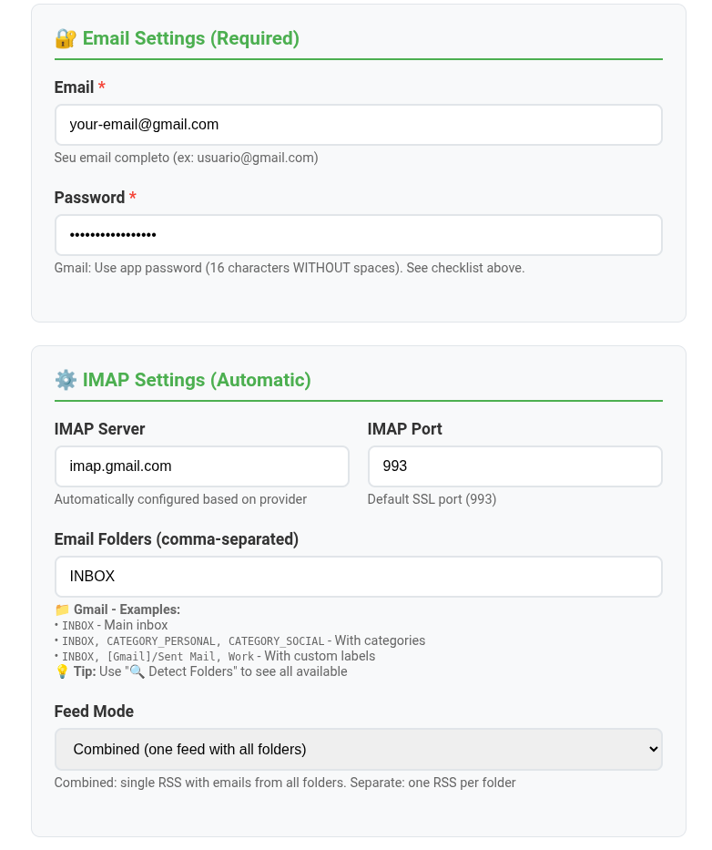
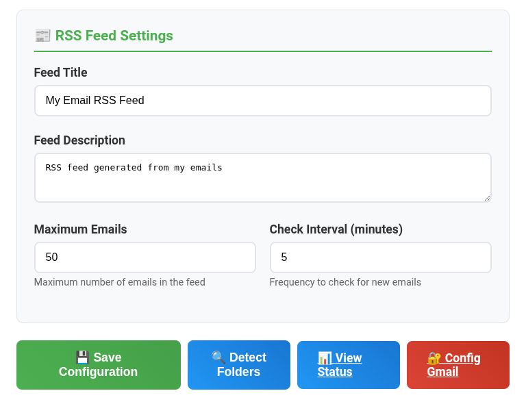

# IMAP to RSS Converter

A Docker application that converts IMAP emails into RSS feeds for integration with RSS readers like FreshRSS.



## 💡 **Perfect for Newsletter Management**

**This project was specifically designed to help you organize newsletters and articles from your email directly into your RSS reader!**

### 📧 **Common Use Cases:**
- **LinkedIn newsletters** and professional updates
- **Substack articles** and Medium publications  
- **GitHub notifications** and project updates
- **Technology newsletters** (The Hustle, Morning Brew, etc.)
- **Business content** and industry reports
- **Any email-based content** you want to read in your RSS reader

### 🎯 **Why Email to RSS?**
- **Centralized reading** - All content in one RSS reader
- **Better organization** - Sort by categories and folders
- **No email clutter** - Keep your inbox clean
- **Offline reading** - Download articles for later
- **Better filtering** - Advanced RSS reader features

## 🌟 Features

- ✅ **Multiple email providers** support (Gmail, Outlook, Yahoo, Zoho)
- ✅ **Automatic provider configuration** with smart defaults
- ✅ **Multiple mailboxes/folders support** with proper UTF-7 decoding
- ✅ **Separate RSS feeds per folder or combined feed**
- ✅ **Web GUI for easy configuration** with mailbox auto-detection
- ✅ **Docker Compose ready** with persistent data
- ✅ **Security-focused** with localhost-only access by default
- ✅ **Automatic periodic updates** (configurable interval)
- ✅ **HTML and plain text email support**
- ✅ **Proper RSS 2.0 compliance** for RSS reader compatibility
- ✅ **Built-in HTTP server** for serving RSS feeds
- ✅ **Health check endpoint** for monitoring

## 📸 Screenshots

### Configuration Interface
The web interface provides an easy way to configure your email settings and manage RSS feeds:

| Provider Selection | Email Settings | Mailbox Detection |
|-------------------|----------------|-------------------|
|  |  |  |

### RSS Feeds Dashboard
View all your available RSS feeds and access them directly:

| RSS Feed List | Status Dashboard |
|---------------|-----------------|
|  |  |

## 🚀 Quick Start

### 1. Clone and Setup

```bash
git clone https://github.com/your-username/imap2rss.git
cd imap2rss

# Copy example configuration
cp .env.example .env
```

### 2. Configure Your Email Credentials

Edit the `.env` file with your email settings:

```bash
# Required - Your email credentials
EMAIL_USER=your-email@gmail.com
EMAIL_PASS=your-app-password
EMAIL_PROVIDER=gmail

# Optional - Customization
MAILBOXES=INBOX
FEED_MODE=combined
FEED_TITLE=My Email RSS Feed
FEED_DESCRIPTION=RSS feed generated from my emails
MAX_EMAILS=50
CHECK_INTERVAL=300
```

### 3. Start with Docker Compose

```bash
# Start the application
docker compose up -d

# Check logs
docker compose logs -f imap2rss
```

### 4. Access the Application

- **Configuration GUI**: http://localhost:9999
- **RSS Feeds**: http://localhost:8888
- **Health Check**: http://localhost:8888/health

## ⚠️ **IMPORTANT - First Time Setup**

**After starting the container for the first time, you MUST configure the check interval to avoid slow RSS feed updates:**

1. 🔄 **First, restart the container**: `docker compose restart`
2. 🌐 **Then go to http://localhost:9999** after the restart
3. ⏱️ **Set "Check Interval" to "1 minute"** (instead of default 5 minutes)
4. 💾 **Click "Save Configuration"** to persist the settings

**Important:** You must restart FIRST, then configure the 1-minute interval. If you configure before restart, it will revert to slow performance again!

> 💡 **Why?** The default configuration uses a 5-minute interval. Setting it to 1 minute AFTER restart ensures near real-time email-to-RSS conversion for better user experience.

## 📧 Email Provider Setup

### Gmail Setup (Recommended)

1. **Enable 2-Factor Authentication** in your Google Account
2. **Generate App Password**:
   - Go to Google Account → Security → 2-Step Verification → App passwords
   - Select "Mail" and generate password
   - Use the generated 16-character password (e.g., `abcd efgh ijkl mnop`)
3. **Enable IMAP** in Gmail settings (Settings → Forwarding and POP/IMAP)

```env
EMAIL_USER=your-email@gmail.com
EMAIL_PASS=your-16-char-app-password
EMAIL_PROVIDER=gmail
```

### Other Providers

<details>
<summary>Outlook/Hotmail</summary>

```env
EMAIL_USER=your-email@outlook.com
EMAIL_PASS=your-password
EMAIL_PROVIDER=outlook
```
</details>

<details>
<summary>Yahoo Mail</summary>

```env
EMAIL_USER=your-email@yahoo.com
EMAIL_PASS=your-app-password
EMAIL_PROVIDER=yahoo
```
</details>

<details>
<summary>Custom IMAP Server</summary>

```env
EMAIL_USER=your-email@example.com
EMAIL_PASS=your-password
EMAIL_PROVIDER=custom
IMAP_SERVER=mail.example.com
IMAP_PORT=993
```
</details>

## 🔧 Configuration

### Environment Variables

| Variable | Default | Description |
|----------|---------|-------------|
| `EMAIL_USER` | - | **Required**: Your email address |
| `EMAIL_PASS` | - | **Required**: Your email password/app password |
| `EMAIL_PROVIDER` | `gmail` | Email provider: `gmail`, `outlook`, `yahoo`, `zoho`, `custom` |
| `IMAP_SERVER` | Auto | IMAP server hostname (auto-configured by provider) |
| `IMAP_PORT` | `993` | IMAP server port |
| `MAILBOXES` | `INBOX` | Comma-separated list of mailboxes to monitor |
| `FEED_MODE` | `combined` | `combined` (single feed) or `separate` (one feed per mailbox) |
| `FEED_TITLE` | `Email RSS Feed` | RSS feed title |
| `FEED_DESCRIPTION` | `RSS feed generated...` | RSS feed description |
| `MAX_EMAILS` | `50` | Maximum emails per feed |
| `CHECK_INTERVAL` | `300` | Check interval in seconds (5 minutes) |
| `HTTP_PORT` | `8888` | RSS server port |
| `CONFIG_PORT` | `9999` | Configuration GUI port |
| `RUN_MODE` | `daemon` | `daemon` (continuous) or `once` (single run) |

### Feed Modes

#### Combined Mode
- **Single RSS feed** with emails from all mailboxes
- Access: `http://localhost:8888/feed.xml`
- Best for: Simple setups, single RSS subscription

#### Separate Mode
- **Individual RSS feed** for each mailbox
- Access: `http://localhost:8888/Mailbox_Name.xml`
- Best for: Organizing emails by categories, multiple RSS subscriptions

### Mailbox Configuration

#### Using the Web GUI (Recommended)
1. Go to http://localhost:9999
2. Enter your email credentials
3. Click "🔍 Detect Mailboxes" to auto-discover available folders
4. Select desired mailboxes
5. Click "Save Configuration"
6. **Restart the container** to apply changes

#### Manual Configuration
Edit the `MAILBOXES` variable in `.env`:

```env
# Single mailbox
MAILBOXES=INBOX

# Multiple mailboxes
MAILBOXES=INBOX, Sent, Work, Personal

# Gmail categories/labels
MAILBOXES=INBOX, [Gmail]/Sent Mail, CATEGORY_PERSONAL, CATEGORY_WORK
```

## 🔄 Important: Restart Required

**Why restart is needed after configuration changes:**

1. **Container reads `.env` at startup** - Environment variables are loaded once when the container starts
2. **Docker Compose volume mounting** - The `.env` file is mounted as a volume, but changes require container restart to take effect
3. **Process environment** - The Python processes need to reload their environment variables

**How to restart:**
```bash
# Method 1: Restart the container
docker compose restart imap2rss

# Method 2: Stop and start
docker compose down
docker compose up -d

# Check if changes were applied
docker compose logs imap2rss
```

## 🔗 RSS Reader Integration

### FreshRSS Integration

1. **Single Feed (Combined Mode)**:
   ```
   http://localhost:8888/feed.xml
   ```

2. **Multiple Feeds (Separate Mode)**:
   ```
   http://localhost:8888/INBOX.xml
   http://localhost:8888/Work_Folder.xml
   http://localhost:8888/Personal_Emails.xml
   ```

3. **Category Organization**: Create categories in FreshRSS and assign feeds accordingly

### Other RSS Readers

The application generates standard RSS 2.0 feeds compatible with:
- FreshRSS
- Feedly
- Inoreader
- NewsBlur
- Any RSS 2.0 compatible reader

## 📁 Project Structure

```
imap2rss/
├── app.py              # Main IMAP to RSS converter
├── server.py           # HTTP server for RSS feeds
├── config_gui.py       # Web configuration interface
├── entrypoint.sh       # Docker entrypoint script
├── Dockerfile          # Docker image definition
├── docker-compose.yml  # Docker Compose configuration
├── requirements.txt    # Python dependencies
├── .env                # Environment configuration
├── .env.example        # Example configuration
├── data/               # Persistent data directory
│   ├── *.xml          # Generated RSS feeds
│   └── feeds_index.json # Feed metadata
└── screenshots/        # Documentation images
```

## 🛠️ Development

### Local Development

```bash
# Clone the repository
git clone https://github.com/your-username/imap2rss.git
cd imap2rss

# Install Python dependencies
pip install -r requirements.txt

# Configure environment
cp .env.example .env
# Edit .env with your settings

# Run components separately
python app.py          # IMAP converter
python server.py       # RSS server
python config_gui.py   # Configuration GUI
```

### Building Docker Image

```bash
# Build image
docker build -t imap2rss .

# Run with Docker
docker run -d \
  --name imap2rss \
  -p 8888:8888 \
  -p 9999:9999 \
  -v $(pwd)/.env:/app/.env \
  -v $(pwd)/data:/app/data \
  imap2rss
```

## 🔒 Security Considerations

- **App Passwords**: Always use app-specific passwords, never your main email password
- **Localhost Only**: Default configuration binds to `127.0.0.1` (localhost only)
- **No External Access**: RSS feeds are only accessible from the local machine
- **Credential Protection**: Keep your `.env` file secure and never commit credentials to version control
- **Network Security**: If exposing externally, use proper authentication and HTTPS

## 🐛 Troubleshooting

### Common Issues

#### 1. Authentication Failed
```
ERROR - Failed to connect to IMAP server: authentication failed
```
**Solution**: 
- Verify email and password are correct
- For Gmail: Ensure you're using App Password, not regular password
- Check if 2FA is enabled and app password is generated

#### 2. No Mailboxes Detected
```
INFO - Available mailboxes: ['INBOX']
```
**Solution**:
- Use the web GUI to auto-detect mailboxes
- Check mailbox names are spelled correctly
- Some providers use different naming conventions

#### 3. Container Restart Issues
```
ERROR - Address already in use
```
**Solution**:
```bash
docker compose down
docker compose up -d
```

#### 4. RSS Feed Empty
```
RSS feed generated but shows no items
```
**Solution**:
- Check if emails exist in specified mailboxes
- Verify `MAX_EMAILS` setting
- Check logs for IMAP connection errors

### Debug Mode

Enable detailed logging:
```bash
# Check container logs
docker compose logs -f imap2rss

# Run single conversion
docker compose exec imap2rss python -c "
import os
os.environ['RUN_MODE'] = 'once'
exec(open('app.py').read())
"
```

## 📝 License

This project is licensed under the MIT License - see the [LICENSE](LICENSE) file for details.

## 🤝 Contributing

1. Fork the repository
2. Create a feature branch (`git checkout -b feature/amazing-feature`)
3. Commit your changes (`git commit -m 'Add amazing feature'`)
4. Push to the branch (`git push origin feature/amazing-feature`)
5. Open a Pull Request

## 📧 Support

- **Issues**: [GitHub Issues](https://github.com/your-username/imap2rss/issues)
- **Discussions**: [GitHub Discussions](https://github.com/your-username/imap2rss/discussions)
- **Email**: [Create an issue](https://github.com/your-username/imap2rss/issues/new) for support requests

## 🙏 Acknowledgments

- Built for seamless integration with [FreshRSS](https://freshrss.org/)
- Inspired by the need for email-to-RSS conversion
- Thanks to all contributors and users providing feedback

---

**Made with ❤️ for the RSS community**


## License

MIT License